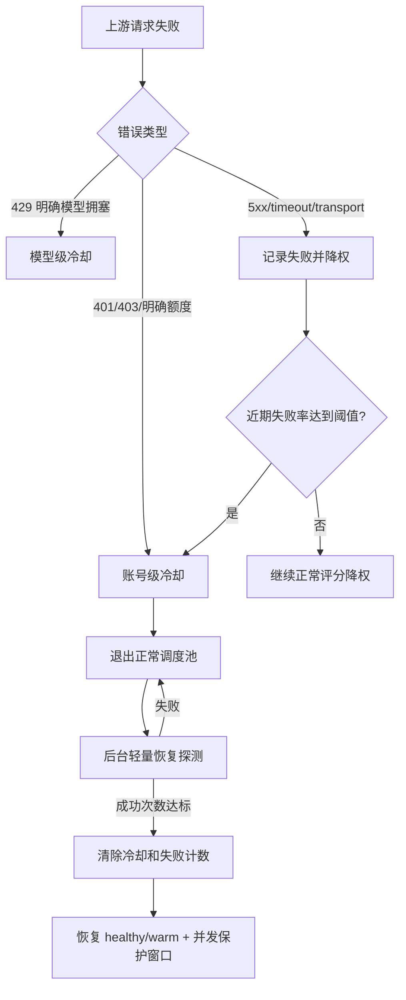

# API Account Cooldown Recovery Design

## 0. 术语约定

- API 账号：运行时 `auth.Account` 中的 OpenAI Responses API 上游账号，代码中通过 `Account.IsOpenAIResponsesAPI()` 判断；本设计也复用通用账号调度状态，不新增平行账号池。
- 账号级冷却：`Account.Status = StatusCooldown` + `cooldown_until/cooldown_reason`，冷却期间不进入正常调度池。
- 模型级冷却：`account_model_cooldowns` 中按账号 + 模型隔离的短冷却，已有 `Store.MarkModelCooldown` 和 `WithModelCooldownFilter`。
- 恢复探测：后台轻量请求，不走正常调度池，只用于确认冷却账号是否可恢复。
- 恢复保护窗口：探测成功后短时间内限制并发，避免刚恢复的账号立刻吃满流量。

## 1. 决策与约束

需求摘要：

- 为上游 API 账号实现谨慎触发的短冷却：401/403/明确额度或订阅问题可账号级处理，普通 5xx/timeout/transport 先降权，只有近期失败率达到阈值才短冷却。
- 冷却期间账号不参与正常调度；后台按可配置间隔探测。
- 探测成功后清除冷却和失败计数，默认恢复到 healthy，同时进入短暂低并发保护窗口。
- 可在系统设置中调整开关、失败率阈值、最少样本、冷却时长、探测间隔、探测成功次数、是否直接 healthy。
- 明确不做：不把普通 5xx/timeout 单次失败直接标记 error；不删除账号；不改变模型级 429 冷却的分流语义；不为 probe 新增用户可见请求入口。

复杂度档位：高并发后端默认档位，有偏离点：调度状态需要跨普通调度器和 FastScheduler 保持一致；后台 probe 需要绕过正常调度但不能绕过账号并发安全。

关键决策：

- 继续复用 `Account.Status/HealthTier/SchedulerScore/DispatchScore`，不新增第二套健康状态。
- 高失败率熔断基于现有 20 位滑动窗口，默认最近 20 次、失败率 ≥80% 才触发短冷却。
- 429 保持现有分流：明确账号额度窗口或 usage limit 走账号级，未知模型拥塞优先模型级。
- API 账号恢复 probe 使用已有测试 payload 和 OpenAI Responses API 执行器；Codex RT 账号继续复用现有 usage probe。
- 探测成功默认 healthy，但通过 `RecoveryGuardUntil` 让并发限制在窗口内降为 1。

前置依赖：无。

## 2. 名词与编排

### 2.1 名词层

现状：

- `database.SystemSettings` 已有 `usage_probe_max_age_minutes`、`recovery_probe_interval_minutes`、`max_rate_limit_retries` 等运行时设置。
- `auth.Account` 已有 `RecentResults`、`FailureStreak`、`HealthTier`、`CooldownUtil`、`CooldownReason`，可支撑失败率判断和调度排除。
- `Store.MarkCooldown` 只特别处理 `unauthorized/rate_limited`，`payment_required` 等账号级原因没有统一健康层级语义。
- `Account.NeedsRecoveryProbe` 只探测 banned 且有 refresh_token 的账号，API 账号没有恢复路径。

变化：

- 新增系统设置字段：
  - `api_account_circuit_breaker_enabled`
  - `api_account_failure_rate_threshold`
  - `api_account_failure_min_samples`
  - `api_account_cooldown_minutes`
  - `api_account_recovery_probe_interval_minutes`
  - `api_account_recovery_probe_successes`
  - `api_account_recovery_direct_healthy`
  - `api_account_recovery_guard_minutes`
- `auth.Account` 新增恢复探测成功计数和恢复保护窗口。
- `auth.Store` 新增 API 账号熔断/恢复配置读写方法，以及高失败率短冷却判断。
- `admin.ProbeUsageSnapshot` 支持 API 账号轻量 probe。

接口示例：

```json
// 来源：admin settings API /api/admin/settings
{
  "api_account_circuit_breaker_enabled": true,
  "api_account_failure_rate_threshold": 80,
  "api_account_failure_min_samples": 20,
  "api_account_cooldown_minutes": 2,
  "api_account_recovery_probe_interval_minutes": 1,
  "api_account_recovery_probe_successes": 1,
  "api_account_recovery_direct_healthy": true,
  "api_account_recovery_guard_minutes": 1
}
```

### 2.2 编排层



现状：

- 请求失败会调用 `ReportRequestFailure` 更新分数；特定 HTTP 状态再调用 `applyCooldownForModel`。
- `Next/NextForSession/FastScheduler` 都会排除 active cooldown。
- 后台刷新周期会触发 usage probe 和 recovery probe。

变化：

- `ReportRequestFailure` 对 server/timeout/transport 只在失败率窗口达标时触发账号短冷却。
- `MarkCooldown` 支持账号级原因统一短冷却，不把普通 server/transport 单次失败直接判死。
- `NeedsRecoveryProbe` 接受 API 账号冷却状态，并使用 API 专属 probe 间隔。
- probe 成功通过统一恢复方法清理冷却、失败计数和 runtime cache，并更新 FastScheduler。

流程级约束：

- 并发：probe 使用现有 `recoveryProbeInFlight` 防重入，批量 probe 保持低并发。
- 错误语义：探测失败只记录日志和失败计数，不删除账号。
- 观测点：冷却 reason 保留 `api_account_failure_rate`、`unauthorized`、`payment_required` 等可读原因。
- 幂等：重复 MarkCooldown 只延长/刷新短冷却，Clear/Recover 可重复调用。

### 2.3 挂载点清单

- 数据库 schema：`system_settings` 新增 API 账号熔断/恢复配置列。
- 管理 API：`GET/PUT /api/admin/settings` 新增配置字段。
- 后台定时任务：已有 `TriggerRecoveryProbeAsync` 现在覆盖 API 账号短冷却。
- 调度器：`Store.Next*` 和 `FastScheduler` 通过现有 cooldown/guard 状态排除或限流。
- 前端设置页：系统设置表单新增相关配置项。

### 2.4 推进策略

1. 配置与状态骨架：新增 settings 字段、Store 配置方法和 Account 恢复保护状态。
   退出信号：数据库 settings 读写、默认值和 admin API 编译通过。
2. 冷却触发计算：接入明确账号级错误与高失败率短冷却。
   退出信号：server/timeout 普通失败只降权，高失败率才 cooldown。
3. 恢复探测：让 API 账号进入恢复 probe，成功后清理冷却并进入保护窗口。
   退出信号：API 账号 cooldown 后不进调度，probe 成功后恢复。
4. 前端设置：类型、默认表单和设置页字段接入。
   退出信号：TypeScript 类型检查通过。
5. 测试覆盖：补 Store、429/settings、probe 相关测试。
   退出信号：目标 Go 测试、前端构建/类型检查通过。

### 2.5 结构健康度与微重构

##### 评估

- 文件级 — `auth/store.go`：文件很大，但本次改动集中在已有账号运行态、调度、probe 区域，属于既有职责延伸；拆文件会引入较多移动风险。
- 文件级 — `proxy/handler.go`：文件很大，本次只小改错误冷却分类，不做行为外搬迁。
- 文件级 — `database/postgres.go` / `database/sqlite.go`：settings 已集中在这里，新增列是既有模式延伸。
- 文件级 — `admin/handler.go`：settings DTO/读写已经在同一段集中维护，本次跟随现有结构。
- 目录级 — 不新增生产代码目录，只新增 CodeStable feature 文档。

##### 结论：不做

本次不做微重构，原因：改动虽跨多个既有大文件，但均是现有 settings / store / scheduler 职责的局部延伸；先搬文件会把行为变更和结构变更混在一起。

##### 超出范围的观察

- `auth/store.go` 和 `proxy/handler.go` 已经偏胖，后续可考虑按 scheduler、cooldown、probe、HTTP endpoint 分拆，建议另走 `cs-refactor`。

## 3. 验收契约

关键场景清单：

- S1：API 账号进入账号级冷却后，`Next/NextForSession/FastScheduler` 都不会在冷却未过期时选中它。
- S2：server/timeout/transport 的单次或少量失败只降低 health/score，不设置账号 cooldown。
- S3：最近失败样本数达到最小样本且失败率达到阈值时，账号进入短冷却，reason 为 `api_account_failure_rate`。
- S4：429 的模型级分流仍然写入 `account_model_cooldowns`，不误触发账号级冷却。
- S5：API 账号冷却期间会按 API 专属恢复探测间隔参与 probe；probe 成功后清除 cooldown、失败计数和 runtime cache。
- S6：probe 成功恢复后默认回到 healthy，并在保护窗口内动态并发限制为 1，窗口过后恢复正常并发。
- S7：系统设置可读写新增配置项，并能即时影响 Store。

明确不做的反向核对项：

- 不应出现普通 5xx/timeout 单次失败直接调用 `MarkError` 的路径。
- 不应删除现有模型级 cooldown 表或改变其主键。
- 不应新增用户可见的 probe endpoint。

## 4. 与项目级架构文档的关系

acceptance 阶段需要把以下内容归并到 `.codestable/architecture/ARCHITECTURE.md`：

- 账号调度健康模型包含账号级 cooldown、模型级 cooldown、高失败率短冷却和恢复 probe。
- API 账号恢复 probe 与普通用量 probe 共用后台触发，但使用 API 账号轻量请求路径。
- 恢复保护窗口是调度层约束，影响并发上限而不是账号状态展示。
